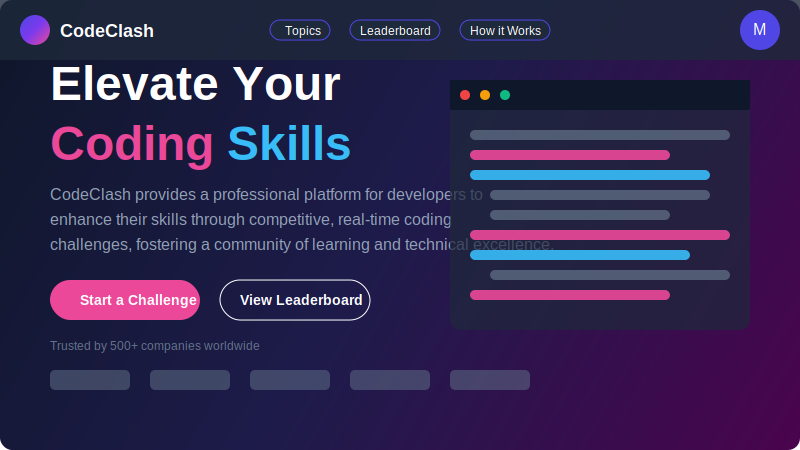

# CodeClash

<div align="center">
  
  <h3>Real-time Competitive Coding Platform</h3>
</div>

<div align="center">
  
  
  
  
  
</div>

<p align="center">
  <a href="#features">Features</a> •
  <a href="#demo">Demo</a> •
  <a href="#tech-stack">Tech Stack</a> •
  <a href="#getting-started">Getting Started</a> •
  <a href="#environment-variables">Environment Variables</a> •
  <a href="#project-structure">Project Structure</a> •
  <a href="#deployment">Deployment</a> •
  <a href="#contributing">Contributing</a> •
  <a href="#license">License</a>
</p>

## Overview

CodeClash is a real-time competitive coding platform where developers can challenge each other to solve coding problems. The platform features live video chat, real-time code collaboration, and a global leaderboard to track progress and rankings.

<div align="center">
  
</div>

## Features

### 🎮 Real-time Coding Battles
- **Live Matchmaking**: Get paired with opponents of similar skill levels
- **AI-Generated Problems**: Unique coding challenges generated for each match
- **Real-time Code Execution**: Test your code against test cases instantly

### 👥 Interactive Experience
- **WebRTC Video Chat**: See and talk to your opponent during the clash
- **Live Code Sharing**: Watch your opponent's code evolve in real-time
- **Instant Feedback**: Get immediate results when you submit your solution

### 🏆 Competitive Elements
- **Global Leaderboard**: Climb the ranks as you win more clashes
- **Performance Metrics**: Track your coding speed and accuracy
- **Topic-based Challenges**: Test your skills across different programming domains

### 🔒 User Management
- **Firebase Authentication**: Secure login with email/password or Google
- **User Profiles**: Customize your profile and track your progress
- **Persistent History**: Review your past clashes and solutions

## Demo

Experience CodeClash live at [https://codeclash-demo.vercel.app](https://codeclash-demo.vercel.app)

## Tech Stack

### Frontend
- **Next.js 14**: React framework with App Router for server and client components
- **TypeScript**: Type-safe code development
- **Tailwind CSS**: Utility-first CSS framework
- **Shadcn/UI**: Reusable UI components
- **Monaco Editor**: Code editor that powers VS Code
- **Framer Motion**: Animations and transitions

### Backend & Infrastructure
- **Firebase Authentication**: User management and authentication
- **Firestore**: NoSQL database for user data and clash information
- **Firebase Realtime Database**: Real-time matchmaking and presence
- **WebRTC**: Peer-to-peer video and data communication
- **Web Workers**: Isolated JavaScript execution environment

### AI Integration
- **Google Gemini**: AI-powered coding problem generation
- **Firebase Extensions**: Serverless functions for AI integration

## Getting Started

### Prerequisites

- Node.js 18.17 or later
- npm or yarn
- Firebase account

### Installation

1. Clone the repository
   ```bash
   git clone https://github.com/Mayankdaya/CodeClash.git
   cd CodeClash
   ```

2. Install dependencies
   ```bash
   npm install
   # or
   yarn install
   ```

3. Set up environment variables
   ```bash
   cp .env.example .env.local
   # Fill in your Firebase configuration in .env.local
   ```

4. Start the development server
   ```bash
   npm run dev
   # or
   yarn dev
   ```

5. Open [http://localhost:3000](http://localhost:3000) in your browser

## Environment Variables

Create a `.env.local` file in the root directory with the following variables:

```env
# Firebase Configuration
NEXT_PUBLIC_FIREBASE_API_KEY=your_api_key
NEXT_PUBLIC_FIREBASE_AUTH_DOMAIN=your_auth_domain
NEXT_PUBLIC_FIREBASE_PROJECT_ID=your_project_id
NEXT_PUBLIC_FIREBASE_STORAGE_BUCKET=your_storage_bucket
NEXT_PUBLIC_FIREBASE_MESSAGING_SENDER_ID=your_messaging_sender_id
NEXT_PUBLIC_FIREBASE_APP_ID=your_app_id
NEXT_PUBLIC_FIREBASE_DATABASE_URL=your_database_url

# Google Gemini API (for AI problem generation)
GEMINI_API_KEY=your_gemini_api_key
```

## Project Structure

```
CodeClash/
├── public/               # Static assets
├── src/
│   ├── app/              # Next.js App Router
│   │   ├── clash/        # Coding battle interface
│   │   ├── leaderboard/  # Global rankings
│   │   ├── lobby/        # Topic selection
│   │   ├── login/        # Authentication
│   │   ├── matching/     # Matchmaking system
│   │   ├── profile/      # User profiles
│   │   ├── signup/       # User registration
│   │   └── page.tsx      # Landing page
│   ├── components/       # Reusable UI components
│   │   ├── ui/           # Base UI components
│   │   └── ...           # Feature-specific components
│   ├── hooks/            # Custom React hooks
│   ├── lib/              # Utility functions
│   │   ├── firebase.ts   # Firebase configuration
│   │   ├── user.ts       # User management
│   │   └── ...           # Other utilities
│   ├── types/            # TypeScript type definitions
│   └── workers/          # Web Workers for code execution
├── .env.example          # Example environment variables
├── .env.local            # Local environment variables (git-ignored)
├── next.config.js        # Next.js configuration
├── package.json          # Project dependencies
├── tailwind.config.js    # Tailwind CSS configuration
└── tsconfig.json         # TypeScript configuration
```

## Deployment

### Vercel Deployment

1. Push your code to GitHub
2. Connect your repository to Vercel
3. Configure environment variables in Vercel dashboard
4. Deploy

### Firebase Hosting

1. Install Firebase CLI
   ```bash
   npm install -g firebase-tools
   ```

2. Login to Firebase
   ```bash
   firebase login
   ```

3. Initialize Firebase Hosting
   ```bash
   firebase init hosting
   ```

4. Build the project
   ```bash
   npm run build
   # or
   yarn build
   ```

5. Deploy to Firebase
   ```bash
   firebase deploy --only hosting
   ```

## Contributing

Contributions are welcome! Please feel free to submit a Pull Request.

1. Fork the repository
2. Create your feature branch (`git checkout -b feature/amazing-feature`)
3. Commit your changes (`git commit -m 'Add some amazing feature'`)
4. Push to the branch (`git push origin feature/amazing-feature`)
5. Open a Pull Request

## License

This project is licensed under the MIT License - see the LICENSE file for details.

---

<div align="center">
  <p>Built with ❤️ by <a href="https://github.com/Mayankdaya">Mayank Daya</a></p>
</div>
