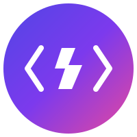

# CodeClash

<div align="center">
  
  <h3>Real-time Competitive Coding Platform</h3>
</div>

<div align="center">
  
  
  
  
  
</div>

<p align="center">
  <a href="#features">Features</a> •
  <a href="#demo">Demo</a> •
  <a href="#tech-stack">Tech Stack</a> •
  <a href="#getting-started">Getting Started</a> •
  <a href="#environment-variables">Environment Variables</a> •
  <a href="#project-structure">Project Structure</a> •
  <a href="#deployment">Deployment</a> •
  <a href="#contributing">Contributing</a> •
  <a href="#license">License</a>
</p>

## Overview

CodeClash is a real-time competitive coding platform where developers can challenge each other to solve coding problems. The platform features live video chat, real-time code collaboration, and a global leaderboard to track progress and rankings.

<div align="center">
  
</div>

## Features

### 🎮 Real-time Coding Battles
- **Live Matchmaking**: Get paired with opponents of similar skill levels
- **AI-Generated Problems**: Unique coding challenges generated for each match
- **Real-time Code Execution**: Test your code against test cases instantly

### 👥 Interactive Experience
- **WebRTC Video Chat**: See and talk to your opponent during the clash
- **Live Code Sharing**: Watch your opponent's code evolve in real-time
- **Instant Feedback**: Get immediate results when you submit your solution

### 🏆 Competitive Elements
- **Global Leaderboard**: Climb the ranks as you win more clashes
- **Performance Metrics**: Track your coding speed and accuracy
- **Topic-based Challenges**: Test your skills across different programming domains

### 🔒 User Management
- **Firebase Authentication**: Secure login with email/password or Google
- **User Profiles**: Customize your profile and track your progress
- **Persistent History**: Review your past clashes and solutions

## Demo

Experience CodeClash live at [https://codeclash-demo.vercel.app](https://codeclash-demo.vercel.app)

## Tech Stack

### Frontend
- **Next.js 14**: React framework with App Router for server and client components
- **TypeScript**: Type-safe code development
- **Tailwind CSS**: Utility-first CSS framework
- **Shadcn/UI**: Reusable UI components
- **Monaco Editor**: Code editor that powers VS Code
- **Framer Motion**: Animations and transitions

### Backend & Infrastructure
- **Firebase Authentication**: User management and authentication
- **Firestore**: NoSQL database for user data and clash information
- **Firebase Realtime Database**: Real-time matchmaking and presence
- **WebRTC**: Peer-to-peer video and data communication
- **Web Workers**: Isolated JavaScript execution environment

### AI Integration
- **Google Gemini**: AI-powered coding problem generation
- **Firebase Extensions**: Serverless functions for AI integration

## Getting Started

### Prerequisites

- Node.js 18.17 or later
- npm or yarn
- Firebase account

### Installation

1. Clone the repository
   ```bash
   git clone https://github.com/Mayankdaya/CodeClash.git
   cd CodeClash
   ```

2. Install dependencies
   ```bash
   npm install
   # or
   yarn install
   ```

3. Set up environment variables
   ```bash
   cp .env.example .env.local
   # Fill in your Firebase configuration in .env.local
   ```

4. Start the development server
   ```bash
   npm run dev
   # or
   yarn dev
   ```

5. Open [http://localhost:3000](http://localhost:3000) in your browser

## Environment Variables

Create a `.env.local` file in the root directory with the following variables:

```env
# Firebase Configuration
NEXT_PUBLIC_FIREBASE_API_KEY=your_api_key
NEXT_PUBLIC_FIREBASE_AUTH_DOMAIN=your_auth_domain
NEXT_PUBLIC_FIREBASE_PROJECT_ID=your_project_id
NEXT_PUBLIC_FIREBASE_STORAGE_BUCKET=your_storage_bucket
NEXT_PUBLIC_FIREBASE_MESSAGING_SENDER_ID=your_messaging_sender_id
NEXT_PUBLIC_FIREBASE_APP_ID=your_app_id
NEXT_PUBLIC_FIREBASE_DATABASE_URL=your_database_url

# Google Gemini API (for AI problem generation)
GEMINI_API_KEY=your_gemini_api_key
```

## Project Structure

```
CodeClash/
├── public/               # Static assets
├── src/
│   ├── app/              # Next.js App Router
│   │   ├── clash/        # Coding battle interface
│   │   ├── leaderboard/  # Global rankings
│   │   ├── lobby/        # Topic selection
│   │   ├── login/        # Authentication
│   │   ├── matching/     # Matchmaking system
│   │   ├── profile/      # User profiles
│   │   ├── signup/       # User registration
│   │   └── page.tsx      # Landing page
│   ├── components/       # Reusable UI components
│   │   ├── ui/           # Base UI components
│   │   └── ...           # Feature-specific components
│   ├── hooks/            # Custom React hooks
│   ├── lib/              # Utility functions
│   │   ├── firebase.ts   # Firebase configuration
│   │   ├── user.ts       # User management
│   │   └── ...           # Other utilities
│   ├── types/            # TypeScript type definitions
│   └── workers/          # Web Workers for code execution
├── .env.example          # Example environment variables
├── .env.local            # Local environment variables (git-ignored)
├── next.config.js        # Next.js configuration
├── package.json          # Project dependencies
├── tailwind.config.js    # Tailwind CSS configuration
└── tsconfig.json         # TypeScript configuration
```

## Deployment

### Vercel Deployment

1. Push your code to GitHub
2. Connect your repository to Vercel
3. Configure environment variables in Vercel dashboard
4. Deploy

### Firebase Hosting

1. Install Firebase CLI
   ```bash
   npm install -g firebase-tools
   ```

2. Login to Firebase
   ```bash
   firebase login
   ```

3. Initialize Firebase Hosting
   ```bash
   firebase init hosting
   ```

4. Build the project
   ```bash
   npm run build
   # or
   yarn build
   ```

5. Deploy to Firebase
   ```bash
   firebase deploy --only hosting
   ```

## Contributing

Contributions are welcome! Please feel free to submit a Pull Request.

1. Fork the repository
2. Create your feature branch (`git checkout -b feature/amazing-feature`)
3. Commit your changes (`git commit -m 'Add some amazing feature'`)
4. Push to the branch (`git push origin feature/amazing-feature`)
5. Open a Pull Request

## License

This project is licensed under the MIT License - see the LICENSE file for details.

## Troubleshooting Common Issues

### "Waiting for an opponent..." Infinite Loading Issue

If you're experiencing an issue where you're stuck on the "Waiting for an opponent..." screen indefinitely, try the following solutions:

1. **Check Firebase Configuration**:
   - Ensure your Firebase project is properly configured with both Firestore Database and Realtime Database
   - Verify that your `.env.local` file has all the required Firebase environment variables:
     ```
     NEXT_PUBLIC_FIREBASE_API_KEY=your_api_key
     NEXT_PUBLIC_FIREBASE_AUTH_DOMAIN=your_project_id.firebaseapp.com
     NEXT_PUBLIC_FIREBASE_PROJECT_ID=your_project_id
     NEXT_PUBLIC_FIREBASE_STORAGE_BUCKET=your_project_id.appspot.com
     NEXT_PUBLIC_FIREBASE_MESSAGING_SENDER_ID=your_messaging_sender_id
     NEXT_PUBLIC_FIREBASE_APP_ID=your_app_id
     NEXT_PUBLIC_FIREBASE_DATABASE_URL=https://your_project_id-rtdb.firebaseio.com
     ```
   - The `NEXT_PUBLIC_FIREBASE_DATABASE_URL` is especially important for the matchmaking feature

2. **Firebase Database Rules**: Ensure your Realtime Database rules allow read/write access for matchmaking:
   ```json
   {
     "rules": {
       "matchmaking": {
         "$topicId": {
           "$uid": {
             ".read": "auth !== null",
             ".write": "auth !== null && (auth.uid === $uid || !data.exists())"
           }
         }
       },
       // Other rules...
     }
   }
   ```

3. **Use the UI Fixes in Latest Version**:
   - The updated matchmaking UI provides a "Refresh Search" button and debug information
   - If waiting more than 2-3 minutes, try using the refresh button or choosing a different topic
   - The debug panel (click the info button) can help diagnose connection issues

4. **Browser Console Check**:
   - Open your browser's developer tools (F12 or right-click → Inspect)
   - Check the console for any errors related to Firebase or matchmaking
   - Verify that your queue entry is being properly added to Firebase

5. **Clear Browser Data**:
   - Clear your browser cache and cookies
   - Try using an incognito/private window

If none of these solutions work, the issue might be with Firebase connectivity or configuration. Refer to the Firebase documentation for more troubleshooting steps.

## Firebase Configuration Guide

For CodeClash to work correctly, especially the matchmaking feature, you need to properly configure Firebase with **both Firestore Database and Realtime Database**. Many users experience the "Waiting for an opponent..." issue due to incomplete Firebase setup.

### 1. Create a Firebase Project

1. Go to the [Firebase Console](https://console.firebase.google.com/)
2. Click "Add project" and follow the steps to create a new project
3. Once your project is created, continue to the next steps

### 2. Register a Web App

1. In your Firebase project dashboard, click the web icon (</>) to add a web app
2. Give your app a name (e.g., "CodeClash")
3. Register the app (no need to set up Firebase Hosting)
4. Copy the Firebase configuration object - you'll need this for the environment variables

### 3. Set Up Authentication

1. In the Firebase Console, go to "Authentication" from the left menu
2. Click "Get started"
3. Enable at least the "Email/Password" sign-in method
4. (Optional) Enable additional sign-in methods like Google, GitHub, etc.

### 4. Set Up Firestore Database

1. From the left menu, click "Firestore Database"
2. Click "Create database"
3. Start in production mode
4. Choose a location closest to your users
5. Set up the following security rules:

```javascript
rules_version = '2';
service cloud.firestore {
  match /databases/{database}/documents {
    match /clashes/{clashId} {
      allow read, write: if request.auth != null;
      
      match /chat/{messageId} {
        allow read, write: if request.auth != null;
      }
    }
    
    match /users/{userId} {
      allow read: if true;
      allow write: if request.auth != null && request.auth.uid == userId;
    }
  }
}
```

### 5. Set Up Realtime Database

This is the MOST CRITICAL step for matchmaking functionality!

1. From the left menu, click "Realtime Database"
2. Click "Create database"
3. Start in test mode for development (you can secure it later)
4. Choose a location closest to your users
5. Once created, set up the following security rules:

```javascript
{
  "rules": {
    "matchmaking": {
      "$topicId": {
        "$userId": {
          ".read": "auth != null",
          ".write": "auth != null && (auth.uid == $userId || !data.exists())"
        }
      }
    },
    "clash-video-signaling": {
      "$clashId": {
        "$userId": {
          ".read": "auth != null",
          ".write": "auth != null"
        }
      }
    }
  }
}
```

6. **Important:** Copy the Realtime Database URL (something like `https://your-project-id-rtdb.firebaseio.com`)

### 6. Set Up Environment Variables

Create a `.env.local` file in the root of your project with the following variables:

```
NEXT_PUBLIC_FIREBASE_API_KEY=your-api-key
NEXT_PUBLIC_FIREBASE_AUTH_DOMAIN=your-project-id.firebaseapp.com
NEXT_PUBLIC_FIREBASE_PROJECT_ID=your-project-id
NEXT_PUBLIC_FIREBASE_STORAGE_BUCKET=your-project-id.appspot.com
NEXT_PUBLIC_FIREBASE_MESSAGING_SENDER_ID=your-messaging-sender-id
NEXT_PUBLIC_FIREBASE_APP_ID=your-app-id
NEXT_PUBLIC_FIREBASE_DATABASE_URL=https://your-project-id-rtdb.firebaseio.com
```

Replace the placeholder values with your actual Firebase configuration.

### 7. Restart Your Development Server

After setting up all the Firebase services and environment variables, restart your development server:

```
npm run dev
```

### Common Issues

1. **Missing Realtime Database URL**: The most common issue is forgetting to set up the Realtime Database or not adding its URL to the environment variables.
2. **Restrictive Security Rules**: If your Firebase security rules are too restrictive, matchmaking may fail.
3. **Browser Cache**: Sometimes old data can be cached. Try clearing your browser cache or using an incognito window.
4. **Multiple Users Required**: Real matchmaking requires at least two different users. Try using the Test Mode feature if you're just experimenting.

## Using the Diagnostics Tool

If you're having issues with matchmaking:

1. Go to the matching page and wait a few seconds
2. Click the "Run diagnostics" button that appears in the UI
3. The diagnostics tool will check all the necessary Firebase connections and permissions
4. Follow the recommendations provided in the results

## Real-Time User Matching Features

CodeClash now includes enhanced real-time user matching capabilities:

### User Presence System

- **Online Users Display**: See who's currently online in the lobby
- **Status Indicators**: Users show as "available" or "in a match"
- **Real-time Updates**: User statuses update automatically as they join or leave

### Direct Match Invitations

- **Challenge Specific Users**: Send direct match invitations to online users
- **Topic Selection**: Choose any coding topic for your direct challenge
- **Real-time Notifications**: Receive notifications when someone challenges you
- **Accept/Decline**: Easily accept or decline incoming match invitations

### Matchmaking Improvements

- **Queue Status**: See how many users are waiting for each topic
- **Visual Indicators**: Topics with waiting users are highlighted
- **Test Mode**: Practice with simulated opponents when no real users are available

These features make it easy to find and challenge other users in real-time, enhancing the social and competitive aspects of CodeClash.

---

<div align="center">
  <p>Built with ❤️ by <a href="https://github.com/Mayankdaya">Mayank Daya</a></p>
</div>
